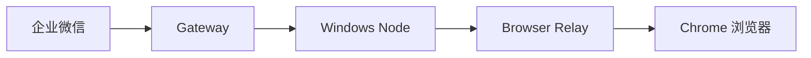

## 功能概述

通过 OpenClaw Browser Relay 扩展，你可以在企业微信中远程控制 Chrome 浏览器，实现：

<CardGroup cols={2}>
  <Card title="网页导航" icon="compass">
    打开网页、前进后退、刷新页面
  </Card>
  <Card title="内容交互" icon="mouse-pointer">
    点击元素、填写表单、滚动页面
  </Card>
  <Card title="信息提取" icon="file-lines">
    获取页面内容、截图、提取数据
  </Card>
  <Card title="标签管理" icon="window-restore">
    创建/关闭标签页、切换标签
  </Card>
</CardGroup>

---

## 架构说明



Browser Relay 是一个 Chrome 扩展，它在浏览器和 OpenClaw Node 之间建立通信桥梁。

---

## 前置条件

<Check>已完成 [远程控制电脑](/features/remote-control) 配置</Check>
<Check>目标电脑已安装 Chrome 浏览器</Check>
<Check>Chrome 版本 88 或更高</Check>

---

## 配置步骤

### 第一步：安装 Browser Relay 扩展

<Tabs>
  <Tab title="从 Chrome 商店安装">
    1. 打开 Chrome 浏览器
    2. 访问 [OpenClaw Browser Relay](https://chrome.google.com/webstore) (即将上线)
    3. 点击 **添加到 Chrome**
  </Tab>
  <Tab title="开发者模式安装">
    1. 下载扩展源码：
    ```bash
    git clone https://github.com/openclaw/browser-relay.git
    ```

    2. 打开 Chrome，访问 `chrome://extensions/`

    3. 开启右上角的 **开发者模式**

    4. 点击 **加载已解压的扩展程序**

    5. 选择 `browser-relay` 文件夹
  </Tab>
</Tabs>

### 第二步：配置扩展

1. 点击 Chrome 工具栏中的 OpenClaw 扩展图标
2. 确保显示 **Relay reachable** 状态
3. 如果显示 **Disconnected**，检查 Node 是否正在运行

### 第三步：配置 Gateway 节点路由

编辑 `~/.openclaw/openclaw.json`：

```json
{
  "gateway": {
    "nodes": {
      "browser": {
        "mode": "auto",
        "node": "my-windows-pc"
      }
    }
  }
}
```

### 第四步：验证连接

在 Gateway 服务器上测试：

```bash
openclaw nodes invoke \
  --node my-windows-pc \
  --command browser.proxy \
  --params '{"method":"GET","path":"/profiles"}'
```

如果返回浏览器配置信息，说明连接成功。

---

## 使用示例

### 基本网页操作

<CodeGroup>

```text 打开网页
帮我打开淘宝
```

```text 搜索内容
在百度搜索 "OpenClaw 教程"
```

```text 获取页面信息
当前页面的标题是什么
```

</CodeGroup>

### 表单操作

<CodeGroup>

```text 填写表单
在搜索框输入 "人工智能"
```

```text 点击按钮
点击登录按钮
```

```text 选择选项
选择下拉菜单中的第二个选项
```

</CodeGroup>

### 高级操作

<CodeGroup>

```text 截图
截取当前页面的截图
```

```text 提取数据
提取页面上所有的链接
```

```text 执行脚本
获取页面上所有图片的地址
```

</CodeGroup>

---

## API 参考

### browser.navigate

导航到指定 URL。

```json
{
  "action": "browser.navigate",
  "params": {
    "url": "https://www.example.com"
  }
}
```

### browser.click

点击页面元素。

```json
{
  "action": "browser.click",
  "params": {
    "selector": "#submit-button"
  }
}
```

### browser.type

在输入框中输入文本。

```json
{
  "action": "browser.type",
  "params": {
    "selector": "#search-input",
    "text": "OpenClaw"
  }
}
```

### browser.screenshot

截取页面截图。

```json
{
  "action": "browser.screenshot",
  "params": {
    "fullPage": true
  }
}
```

### browser.evaluate

执行 JavaScript 代码。

```json
{
  "action": "browser.evaluate",
  "params": {
    "script": "document.title"
  }
}
```

---

## 常见问题

<AccordionGroup>
  <Accordion title="扩展显示 Disconnected">
    **可能原因**：
    1. OpenClaw Node 未运行
    2. Node 未正确配置

    **解决方案**：
    1. 确保 Node 正在运行：`openclaw node run --host ...`
    2. 检查 Node 日志是否有错误
    3. 重新加载扩展
  </Accordion>

  <Accordion title="无法控制某些页面">
    **原因**：Chrome 扩展无法访问某些特殊页面

    **受限页面**：
    - `chrome://` 开头的页面
    - Chrome 网上应用店
    - 其他扩展的页面

    **解决方案**：
    这是 Chrome 的安全限制，无法绑过。请在普通网页上使用。
  </Accordion>

  <Accordion title="操作响应很慢">
    **可能原因**：
    1. 网络延迟
    2. 页面加载慢
    3. 选择器匹配慢

    **解决方案**：
    1. 检查网络连接质量
    2. 等待页面完全加载后再操作
    3. 使用更精确的 CSS 选择器
  </Accordion>
</AccordionGroup>

---

## 安全注意事项

<Warning>
  浏览器控制功能可以访问你的浏览器数据，请注意以下安全事项。
</Warning>

| 风险 | 建议 |
|------|------|
| 密码泄露 | 不要在有密码的页面使用截图功能 |
| Cookie 泄露 | 定期清理浏览器 Cookie |
| 敏感操作 | 不要自动化银行、支付等敏感操作 |
| 权限控制 | 只给信任的用户开放浏览器控制权限 |

---

## 下一步

<CardGroup cols={2}>
  <Card
    title="群聊支持"
    icon="users"
    href="/features/group-chat"
  >
    在企业微信群中使用 AI 助手
  </Card>
  <Card
    title="安全配置"
    icon="shield"
    href="/configuration/security"
  >
    了解更多安全最佳实践
  </Card>
</CardGroup>
