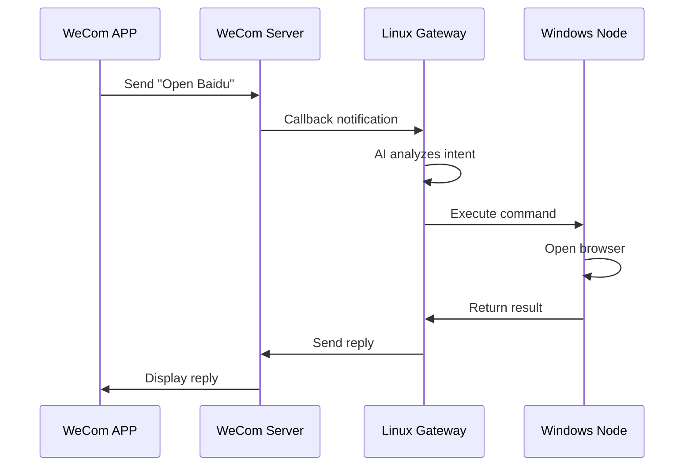

## Overview

With WeCom OpenClaw Plugin, you can send commands via WeCom to remotely control computers connected to the Gateway.

<Info>
  Supported operations: open websites, launch programs, execute commands, view files, and more.
</Info>

## Architecture



---

## Prerequisites

<Check>Linux server with WeCom plugin configured (see [Quick Start](/quickstart-en))</Check>
<Check>Target computer can access Gateway's port 18789</Check>
<Check>Node.js 18+ installed on target computer</Check>

---

## Setup Steps

### Step 1: Install OpenClaw on Target Computer

<Tabs>
  <Tab title="Windows">
    ```powershell
    npm install -g openclaw
    ```

    Verify:
    ```powershell
    openclaw --version
    ```
  </Tab>
  <Tab title="macOS">
    ```bash
    npm install -g openclaw
    ```

    Verify:
    ```bash
    openclaw --version
    ```
  </Tab>
  <Tab title="Linux">
    ```bash
    npm install -g openclaw
    ```

    Verify:
    ```bash
    openclaw --version
    ```
  </Tab>
</Tabs>

### Step 2: Configure Gateway

#### 2.1 Set Gateway Token

On the Linux server, set token when starting Gateway:

```bash
export OPENCLAW_GATEWAY_TOKEN=your_secret_token_here
openclaw gateway run --bind lan --port 18789
```

<Warning>
  Use a strong password as Token. Don't use the example value.
</Warning>

#### 2.2 Configure Node Routing

Edit `~/.openclaw/openclaw.json`:

```json
{
  "gateway": {
    "mode": "local",
    "bind": "lan",
    "nodes": {
      "browser": {
        "mode": "auto",
        "node": "my-windows-pc"
      }
    }
  }
}
```

### Step 3: Connect Node

#### 3.1 Configure Execution Permission

On the target computer:

<Tabs>
  <Tab title="Windows">
    ```powershell
    openclaw config set tools.exec.security full
    ```
  </Tab>
  <Tab title="macOS / Linux">
    ```bash
    openclaw config set tools.exec.security full
    ```
  </Tab>
</Tabs>

#### 3.2 Connect to Gateway

<Tabs>
  <Tab title="Windows">
    ```powershell
    $env:OPENCLAW_GATEWAY_TOKEN="your_secret_token_here"
    openclaw node run --host <Gateway-IP> --port 18789
    ```
  </Tab>
  <Tab title="macOS / Linux">
    ```bash
    export OPENCLAW_GATEWAY_TOKEN=your_secret_token_here
    openclaw node run --host <Gateway-IP> --port 18789
    ```
  </Tab>
</Tabs>

Success output:

```
🦞 OpenClaw 2026.x.x
node host PATH: ...
```

#### 3.3 Verify Connection

On Gateway server:

```bash
openclaw nodes status
```

You should see your node as `paired · connected`.

### Step 4: Configure AI Agent

Edit `~/.openclaw/workspace/TOOLS.md`:

```markdown
## Remote Windows PC Control

You have a connected remote Windows PC node: **my-windows-pc**

### Must use nodes tool

When user requests the following, use nodes tool:
- Open website/browser
- Open program/application
- View files/folders
- Execute any Windows command

### nodes tool usage

action: "run"
node: "my-windows-pc"
command: ["cmd", "/c", "your_command"]

### Examples

| User Request | command parameter |
|--------------|-------------------|
| Open Baidu | ["cmd", "/c", "start", "https://www.baidu.com"] |
| Open VSCode | ["cmd", "/c", "code"] |
| List desktop files | ["cmd", "/c", "dir", "C:\\Users\\Username\\Desktop"] |
```

---

## Usage Examples

After configuration, you can send these commands in WeCom:

<CardGroup cols={2}>
  <Card title="Open Website">
    ```
    Open Google
    ```
    ```
    Open GitHub for me
    ```
  </Card>
  <Card title="Launch Program">
    ```
    Open VSCode
    ```
    ```
    Start WeChat
    ```
  </Card>
  <Card title="View Files">
    ```
    What files are on my desktop?
    ```
    ```
    List folders in D drive
    ```
  </Card>
  <Card title="Execute Command">
    ```
    Show system info
    ```
    ```
    What's my IP address?
    ```
  </Card>
</CardGroup>

---

## Troubleshooting

<AccordionGroup>
  <Accordion title="Node disconnects immediately">
    **Possible causes:**
    1. Token mismatch
    2. Firewall blocking connection
    3. Unstable network

    **Solutions:**
    1. Ensure Gateway and Node use the same Token
    2. Check firewall allows port 18789
    3. Use a stable network connection
  </Accordion>

  <Accordion title="Command shows 'approval required'">
    **Cause:** Execution permission not configured

    **Solution:**
    ```bash
    openclaw config set tools.exec.security full
    ```
  </Accordion>

  <Accordion title="AI doesn't use nodes tool">
    **Possible causes:**
    1. TOOLS.md not configured correctly
    2. Need to start new session

    **Solutions:**
    1. Verify `~/.openclaw/workspace/TOOLS.md` is correct
    2. Send `/new` in WeCom to start new session
    3. Or restart Gateway
  </Accordion>
</AccordionGroup>

---

## Security Recommendations

<Warning>
  Remote control has elevated privileges. Please follow security best practices.
</Warning>

| Recommendation | Description |
|----------------|-------------|
| Use strong Token | At least 32 random characters |
| Limit network access | Gateway only listens on LAN IP |
| Rotate Token regularly | Recommend monthly rotation |
| Audit logs | Regularly check execution logs |
| Least privilege | Only grant access to necessary users |

---

## Next Steps

<CardGroup cols={2}>
  <Card
    title="Browser Control"
    icon="browser"
    href="/features/browser-control"
  >
    Fine-grained Chrome browser control
  </Card>
  <Card
    title="Security Configuration"
    icon="shield"
    href="/configuration/security"
  >
    Learn more security best practices
  </Card>
</CardGroup>
