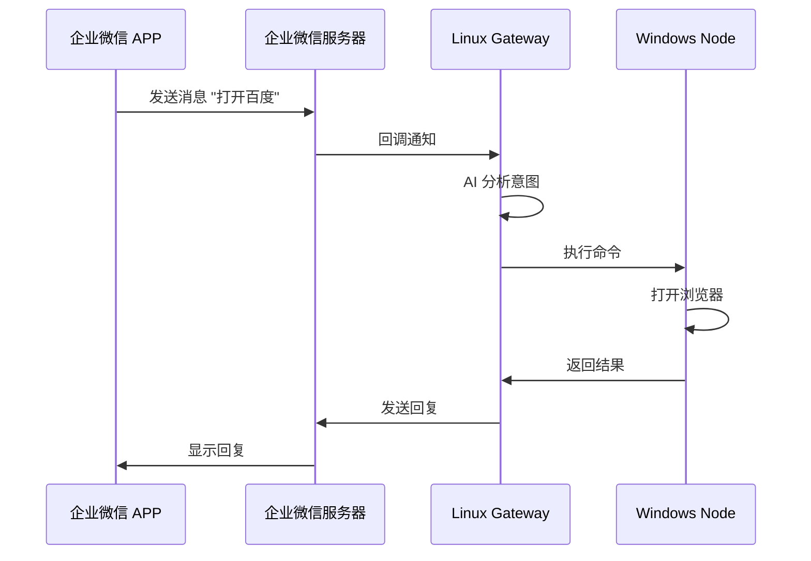

## 功能概述

通过 WeCom OpenClaw Plugin，你可以在企业微信中发送指令，远程控制连接到 Gateway 的电脑节点。

<Info>
  支持的操作包括：打开网页、启动程序、执行命令、查看文件等。
</Info>

## 架构说明



---

## 前置条件

<Check>Linux 服务器已配置好 WeCom 插件（参考 [快速入门](/quickstart)）</Check>
<Check>Windows/Mac 电脑可以访问 Linux 服务器的 18789 端口</Check>
<Check>目标电脑已安装 Node.js 18+</Check>

---

## 配置步骤

### 第一步：在目标电脑上安装 OpenClaw

<Tabs>
  <Tab title="Windows">
    ```powershell
    npm install -g openclaw
    ```

    验证安装：
    ```powershell
    openclaw --version
    ```
  </Tab>
  <Tab title="macOS">
    ```bash
    npm install -g openclaw
    ```

    验证安装：
    ```bash
    openclaw --version
    ```
  </Tab>
  <Tab title="Linux">
    ```bash
    npm install -g openclaw
    ```

    验证安装：
    ```bash
    openclaw --version
    ```
  </Tab>
</Tabs>

### 第二步：配置 Gateway

#### 2.1 设置 Gateway Token

在 Linux 服务器上，启动 Gateway 时设置 token：

```bash
export OPENCLAW_GATEWAY_TOKEN=your_secret_token_here
openclaw gateway run --bind lan --port 18789
```

<Warning>
  请使用强密码作为 Token，不要使用示例中的值。
</Warning>

#### 2.2 配置节点路由

编辑 `~/.openclaw/openclaw.json`，添加节点配置：

```json
{
  "gateway": {
    "mode": "local",
    "bind": "lan",
    "nodes": {
      "browser": {
        "mode": "auto",
        "node": "my-windows-pc"
      }
    }
  }
}
```

### 第三步：连接节点

#### 3.1 配置执行权限

在目标电脑上运行：

<Tabs>
  <Tab title="Windows">
    ```powershell
    openclaw config set tools.exec.security full
    ```
  </Tab>
  <Tab title="macOS / Linux">
    ```bash
    openclaw config set tools.exec.security full
    ```
  </Tab>
</Tabs>

#### 3.2 连接到 Gateway

<Tabs>
  <Tab title="Windows">
    ```powershell
    $env:OPENCLAW_GATEWAY_TOKEN="your_secret_token_here"
    openclaw node run --host <Gateway服务器IP> --port 18789
    ```
  </Tab>
  <Tab title="macOS / Linux">
    ```bash
    export OPENCLAW_GATEWAY_TOKEN=your_secret_token_here
    openclaw node run --host <Gateway服务器IP> --port 18789
    ```
  </Tab>
</Tabs>

看到以下输出说明连接成功：

```
🦞 OpenClaw 2026.x.x
node host PATH: ...
```

#### 3.3 验证连接

在 Gateway 服务器上运行：

```bash
openclaw nodes status
```

应该看到你的节点显示为 `paired · connected`。

### 第四步：配置 AI Agent

编辑 `~/.openclaw/workspace/TOOLS.md`，告诉 AI 如何使用节点：

```markdown
## 远程 Windows 电脑控制

你有一个已连接的远程 Windows 电脑节点：**my-windows-pc**

### 必须使用 nodes 工具

当用户要求以下操作时，必须使用 nodes 工具：
- 打开网页/浏览器
- 打开程序/应用
- 查看文件/文件夹
- 执行任何 Windows 命令

### nodes 工具用法

action: "run"
node: "my-windows-pc"
command: ["cmd", "/c", "你的命令"]

### 示例

| 用户请求 | command 参数 |
|---------|-------------|
| 打开百度 | ["cmd", "/c", "start", "https://www.baidu.com"] |
| 打开 VSCode | ["cmd", "/c", "code"] |
| 查看桌面文件 | ["cmd", "/c", "dir", "C:\\Users\\用户名\\Desktop"] |
```

---

## 使用示例

配置完成后，你可以在企业微信中发送以下指令：

<CardGroup cols={2}>
  <Card title="打开网页">
    ```
    打开百度
    ```
    ```
    帮我打开 GitHub
    ```
  </Card>
  <Card title="启动程序">
    ```
    打开 VSCode
    ```
    ```
    启动微信
    ```
  </Card>
  <Card title="查看文件">
    ```
    查看桌面有哪些文件
    ```
    ```
    列出 D 盘的文件夹
    ```
  </Card>
  <Card title="执行命令">
    ```
    查看系统信息
    ```
    ```
    查看 IP 地址
    ```
  </Card>
</CardGroup>

---

## 常见问题

<AccordionGroup>
  <Accordion title="节点连接后立即断开">
    **可能原因**：
    1. Token 不一致
    2. 防火墙阻止连接
    3. 网络不稳定

    **解决方案**：
    1. 确保 Gateway 和 Node 使用相同的 Token
    2. 检查防火墙是否允许 18789 端口
    3. 尝试使用稳定的网络连接
  </Accordion>

  <Accordion title="命令执行提示 approval required">
    **原因**：未配置执行权限

    **解决方案**：
    ```bash
    openclaw config set tools.exec.security full
    ```
  </Accordion>

  <Accordion title="AI 不使用 nodes 工具">
    **可能原因**：
    1. TOOLS.md 未正确配置
    2. 需要开始新会话

    **解决方案**：
    1. 确保 `~/.openclaw/workspace/TOOLS.md` 已正确配置
    2. 在企业微信发送 `/new` 开始新会话
    3. 或重启 Gateway
  </Accordion>
</AccordionGroup>

---

## 安全建议

<Warning>
  远程控制功能具有较高权限，请务必注意安全。
</Warning>

| 建议 | 说明 |
|------|------|
| 使用强 Token | 至少 32 位随机字符串 |
| 限制网络访问 | Gateway 只监听内网 IP |
| 定期更换 Token | 建议每月更换一次 |
| 审计日志 | 定期检查执行日志 |
| 最小权限 | 只给必要的用户开放访问 |

---

## 下一步

<CardGroup cols={2}>
  <Card
    title="浏览器控制"
    icon="browser"
    href="/features/browser-control"
  >
    更精细地控制 Chrome 浏览器
  </Card>
  <Card
    title="安全配置"
    icon="shield"
    href="/configuration/security"
  >
    了解更多安全最佳实践
  </Card>
</CardGroup>
