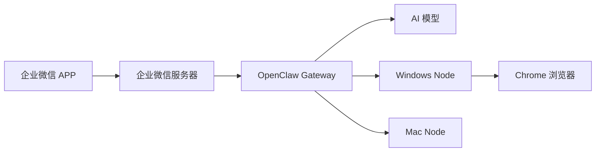

## 什么是 WeCom OpenClaw Plugin？

WeCom OpenClaw Plugin 是一个企业微信集成插件，让你可以：

<CardGroup cols={2}>
  <Card
    title="AI 对话"
    icon="message-bot"
    href="/quickstart"
  >
    在企业微信中与 AI 助手自然对话，支持多种大语言模型
  </Card>
  <Card
    title="远程控制"
    icon="desktop"
    href="/features/remote-control"
  >
    通过企业微信远程控制 Windows/Mac/Linux 电脑
  </Card>
  <Card
    title="浏览器控制"
    icon="browser"
    href="/features/browser-control"
  >
    远程操控 Chrome 浏览器，自动化网页操作
  </Card>
  <Card
    title="群聊支持"
    icon="users"
    href="/features/group-chat"
  >
    在企业微信群中 @AI 助手，团队协作更高效
  </Card>
</CardGroup>

## 架构概览

## 核心特性

<AccordionGroup>
  <Accordion title="多模型支持">
    支持 OpenRouter、OpenAI、Anthropic、阿里云等多种 AI 模型提供商。
    可以根据需求选择最适合的模型。
  </Accordion>
  <Accordion title="安全可靠">
    - 企业微信官方 API 加密通信
    - Gateway Token 认证
    - 可配置的命令执行权限
    - 支持内网部署
  </Accordion>
  <Accordion title="易于部署">
    - 支持 Docker 一键部署
    - 详细的配置文档
    - 完善的错误提示
  </Accordion>
  <Accordion title="扩展性强">
    - 基于 OpenClaw 插件架构
    - 支持自定义工具
    - 支持多节点分布式部署
  </Accordion>
</AccordionGroup>

## 快速开始

<Steps>
  <Step title="获取企业微信凭证">
    在企业微信管理后台创建应用，获取 Corp ID、Agent ID、Secret 等凭证。
  </Step>
  <Step title="部署 Gateway">
    在服务器上安装 OpenClaw 并配置 WeCom 插件。
  </Step>
  <Step title="配置回调">
    在企业微信后台设置消息回调 URL。
  </Step>
  <Step title="开始对话">
    在企业微信 APP 中找到应用，发送消息开始对话！
  </Step>
</Steps>

<Card title="5 分钟快速入门" icon="rocket" href="/quickstart">
  按照我们的快速入门指南，5 分钟内完成配置
</Card>

## 系统要求

| 组件 | 要求 |
|------|------|
| Node.js | 18.0 或更高版本 |
| 操作系统 | Linux / macOS / Windows |
| 网络 | 公网 IP 或内网穿透 |
| 企业微信 | 管理员权限 |

## 获取帮助

<CardGroup cols={2}>
  <Card
    title="GitHub Issues"
    icon="github"
    href="https://github.com/11haonb/wecom-openclaw-plugin/issues"
  >
    报告 Bug 或提交功能请求
  </Card>
  <Card
    title="联系作者"
    icon="envelope"
    href="mailto:liujinqi@bit.edu.cn"
  >
    liujinqi@bit.edu.cn
  </Card>
</CardGroup>
